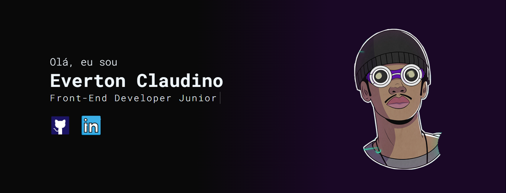

<h1 align="center">
  💻 Portfólio - Everton Claudino
</h1>

## 📚 Seções

O site é composto por quatro seções:

- **Home:** Nele temos uma breve apresentação do site;
- **Quem sou:** Nessa seção tenho uma descrição dizendo um pouco sobre quem sou;
- **Projetos:** Apresenta alguns projetos em desenvolvimentos e com link direto para o meu GitHub;
- **Conhecimentos:** Nele apresento meus conhecimentos em algumas linguagens como o foco no front-end;

---

## 💼 Tecnologias utilizadas

Para o desenvolvimento deste site utilizei as seguintes tecnologias:

- HTML;
- CSS3;
- JavaScript;
---

<h2>🦄 Autor</h2>

<table>
  <tr>
    <td align="center">
      <a href="https://github.com/EvertonClaudino">
         
        
          <b>Everton Claudino</b>
        
      </a>
    </td>
  </tr>
</table>
