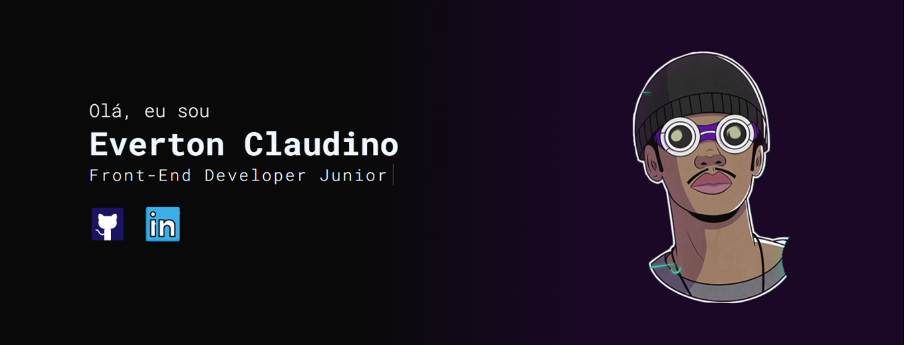

<h1 align="center">💻 Portfólio — Everton Claudino</h1>

  

  <a href="https://evertonclaudino.vercel.app/">🌐 Ver Portfólio ao Vivo</a>

---

## 📋 Sobre o Projeto

Portfólio pessoal desenvolvido para apresentar a minha jornada como **Full-Stack Developer Júnior**, incluindo projetos reais, habilidades técnicas e formas de contacto. Disponível em **PT 🇵🇹 e EN 🇬🇧**.

---

## 📚 Secções

| Secção | Descrição |
|---|---|
| **Home** | Apresentação e título profissional |
| **Quem Sou** | Trajetória, motivação e perfil profissional |
| **Projetos** | Projetos reais com links para demo e GitHub |
| **Habilidades** | Stack técnico de Front-End, Back-End e ferramentas |
| **Contacto** | Formulário direto de contacto |

---

## 🚀 Projetos em Destaque

- **[AlPainters](https://evertonclaudino.vercel.app/)** — Landing page institucional para empresa de construção e pintura
- **[PrimeFlow](https://primeflow-landing.vercel.app)** — Dashboard financeiro para pequenas e médias empresas

---

## 💼 Tecnologias Utilizadas

  

---

## ✏️ Autor

<table>
  <tr>
    <td align="center">
      <a href="https://github.com/EvertonClaudino">
         
        <b>Everton Claudino</b>
      </a>
    </td>
  </tr>
</table>
